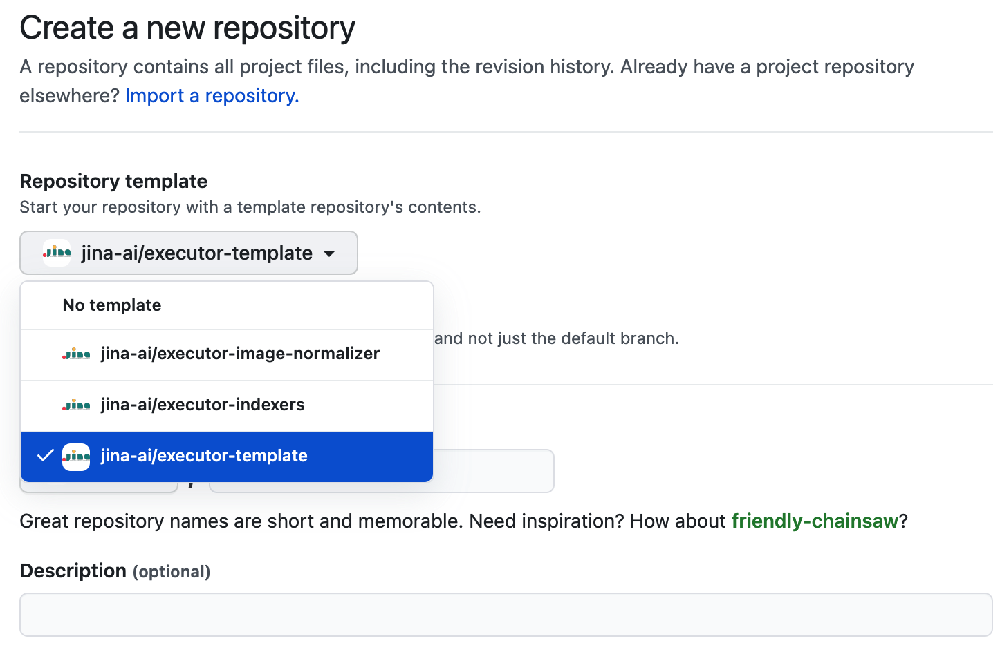
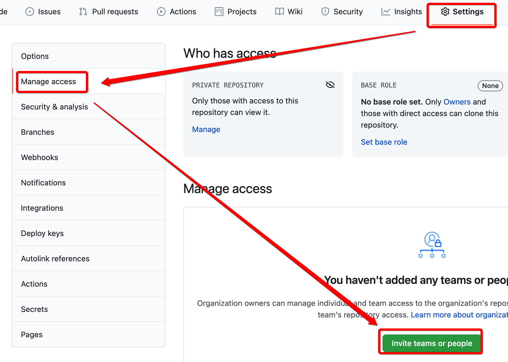

<!-- START doctoc generated TOC please keep comment here to allow auto update -->
<!-- DON'T EDIT THIS SECTION, INSTEAD RE-RUN doctoc TO UPDATE -->
**Table of Contents**

- [🏗️ STEPS TO CREATE AN EXECUTOR](#-steps-to-create-an-executor)

<!-- END doctoc generated TOC please keep comment here to allow auto update -->

# 🏗️ STEPS TO CREATE AN EXECUTOR

1. Create a new repo with the template `jina-ai/executor-template`. Follow the repository naming convention in the [Guideline](GUIDELINES.md#repository)

	

1. Add `admin` access to `jina-ai/engineering` and `jina-ai/jina-bot`.
   
   
   
1. Replace the following variables in `setup.py`, `manifest.yml`, `config.yml`, `MODULE_NAME.py`
	- `MyDummyExecutor`
	- `jinahub-MY-DUMMY-EXECUTOR`
	- `EXECUTOR_REPO_NAME`
	- `SUB_PACKAGE_NAME`
	- `MODULE_NAME`

1. Implement your executor and write tests

1. Write `README.md`